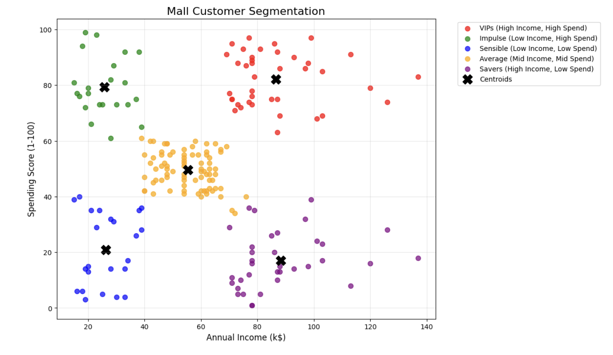

# mall_customer_segmentation
## Executive Summary

**Project Goal:**

I began this project to practice K-Means Clustering with Unsupervised Learning. For the project, I used the mall customer segmentation dataset. The goal was to identify and understand different customer segments based on shoppers' income and spending habits.

**Methodology:**

Though standard libraries like scikit-learn exist, this project manually implements the K-Means Clustering algorithm. This demonstrates the math behind the algorithm, including centroid initialization, distance calculation, and iterative optimization.

**Results:**

The model successfully identified 5 distinct customer groups, providing insights into target groups for marketing strategies.

## Technologies Used

* Python 3
* NumPy (manual implementation of K-Means)
* Pandas (Data manipulation)
* Matplotlib and Seaborn (Data visualization)

## Key Features

* **Manual Implementation:** Instead of using scikit-learn library, I built K-Means from scratch.
* **Cluster Profiling:** This project identified 5 unique clusters of customer personas.

## How to Run:

1. Clone the repository
2. Install dependencies (pandas, numpy, matplotlib, seaborn)
3. Run the notebook in Jupyter Notebook
